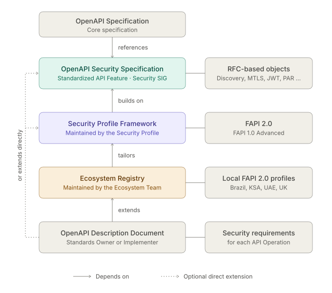

# Creating Decoupled Security Profiles in OpenAPI to Support FAPI 2.0 and GNAP

## Metadata

| Tag | Value |
| --- | --- |
| Proposal | [2026-09-25-Security-Profiles](https://github.com/OAI/sig-security/tree/main/proposals/2026-09-25-Security-Profiles.md) |
| Authors | [Chris Wood](https://github.com/sensiblewood) |
| Review Manager | TBD |
| Status | Proposal |
| Implementations | N/A |
| Issues | [{issueid}](https://github.com/OAI/sig-security/issues/{IssueId}) |
| Previous Revisions | [{revid}](https://github.com/OAI/sig-security/pull/{revid}) |

## Change Log

| Date | Responsible Party | Description |
| --- | --- | --- |
| 2026-09-19 | Chris Wood | Pre-PR version, "sounding board" for feedback |
| 2026-09-25 | Chris Wood | Submission as PR to sig-security repository |

## Introduction

A direct excerpt from the GitHub Discussion that preceded this proposal: [#50](https://github.com/OAI/sig-security/discussions/50).

> This proposal [therefore] suggests a way forward on unlocking the means to describe security profiles in a suitably deterministic and loosely coupled way that provides API consumers with the affordances required to accurately understand the security requirements for a given Operation.

To add to this: The proposal also provide an approach to provide affordances for agentic use cases that enable AI agents to read and assemble OpenAPI-based tooling in a deterministic way.

> Disclosure: Diagrams in this document were AI-generated based on instructions from the author and have been checked for consistency with the text and the material they reference.

## Motivation

This excerpt is again from the GitHub Discussion referenced [above](#introduction).

> The OpenAPI Specification provides a number of Security Scheme objects that are, largely speaking a "point in time" view of a security requirement.
>
> Take OAuth Flow Objects for example. OAuth Flow objects create a description of the security requirements for invoking given Operation that requires providing static properties that may not duplicate properties from the source of truth for the OAuth implementation. This duplication creates an inherent risk of drift, with security properties being updated in two places, with the OpenAPI view of OAuth often often much less rich than say - for example - OAuth Server Metadata.
>
> Security Scheme Objects therefore potentially create a tight coupling between a given Operation Object (or the entire API description) and a snapshot of the OAuth configuration for that Operation. This approach served older versions of the OpenAPI Specification adequately enough, but the evolution of the security space and the creation of profile-based OAuth and OpenID Connect specification, such as the [FAPI 2.0 Security Profile](https://openid.net/specs/fapi-security-profile-2_0-final.html), has resulted in a significant gap between what the OpenAPI Specification can describe, and what such security profiles need to describe to API consumers.

The analysis above describes the current "state of the union" in the OpenAPI Specification viz. how API security, especially complex profiles like the FAPI security profiles, are currently supported. Profile like FAPI cannot be described in a clear and authoritative manner, because OpenAPI lacks the richness to describe them. However, "porting" all objects from a profile like FAPI to OpenAPI is almost certainly not the answer, because this creates a maintenance overhead for allowing OpenAPI to keep pace with changes to a security profile.

A middle ground is therefore required that allows the OpenAPI Specification to support a suitably deterministic vocabulary that defines the objects that apply to a given API Operation, while still allow flexibility and portability. Taking the example of the FAPI 2.0 profile mentioned above, API security actually breaks down into many complex relationships, as shown in the following (AI-generated) diagram:



Clearly representing all the RFC and BCPs in the OpenAPI Specification is going to be impossible to achieve _in full_, but the Specification should be able to do "just enough" to provide a view of the security requirements that can do the following provide enough information for a Client to bootstrap the security requirement, and then potentially source data through external references to generate an appropriate representation.

There is also a need to not "throw the baby out with the bath water" in that creating completely flexible specifications with few deterministic references does nothing to grow the OpenAPI "brain", as future features cannot leverage existing, normalized features. Going back to OAuth Flow Objects, these are actually a great feature to have, but leveraging them implies a fixed metadata footprint, in that `tokenUrl` **must** be supplied in all Flow objects and for example `authorizationUrl` must be declared for the `authorizationCode` Flow object. The shape of the object is therefore not manifestly incorrect, but the **_placement of the metadata is._**, especially in conjunction with security profiles like FAPI 2.0 where OAuth Server Metadata or OpenID Connect Discovery are a very real and widely deployed part of the approach. Security metadata must therefore be abstracted away from the OpenAPI Specification itself, and encapsulated by appropriate rules to ensure values can be deterministically sourced.

We also have industry-specific needs that reflect how API security profiles are used in the real world. Going back to FAPI 2.0 again, while the FAPI Working Group maintains the core specification many jurisdictions define a local profile that tailors the constraints for the local market and sets out mandated or out of scope elements of the core specification, for example the [UAE Security Profile](https://openfinanceuae.atlassian.net/wiki/spaces/standardsv2dot1final/pages/702414912/Security+Profile+-+FAPI), which is then subject to certification. Being able to create a clear underlying definition of FAPI 2.0 in OpenAPI Specification **_and_** being able to inherit that profile for given market would be a massive boost for API consumers and providers alike.

The proposal herein therefore sets out the approach to implementing a model for security profiles that aims to achieve a number of goals reflecting the discussion above, namely:

- Allow complex security requirements to be modeled effectively, providing sufficient information to humans or machines to understand the construct or infer requirements in code from the security requirement.
- Allow API security requirements to be incorporated in the OpenAPI Specification in a modular way.
- Ensure that all security metadata is provided by means that reflect the salient approaches for discovery by clients, and supports runtime resolution.
- Allow security profiles to be reused by API providers, either directly or through industry standards bodies.

The approach to achieving these goals is described in the following sections.

## Proposed solution

One of the key goals above is to allow a security description to be developed in a modular way, with increasing levels of granularity and configurability.

The basis of the proposed approach is as follows:

1. A separate, dedicated OpenAPI Security Specification (OSS), referenced by the OpenAPI Specification carries objects that are specifically for API security. The OSS will nominally be developed under the banner of a Standardized API Feature (SAF), but this is subject to discussion with TSC and more work on evolving the approach to ensure it is the right framework for delivery.
2. One-or-more features can be brought together to create a Security Profile, using the OSS as the main vocabulary but declaring them as a standalone specification. Examples of a Security Profile would be FAPI 1.0 Advanced, or FAPI 2.0, or the Open Payments GNAP profile (part of the main GNAP implementation, but fits the profile for this feature).
3. A given Security Profile can also be tailored to fit customization frequently found in industry profiles, as discussed above, which is published in an Ecosystem Registry. Examples of a Registry entry would be the local FAPI security profiles found in open banking and open finance jurisdiction like Brazil, KSA, UAE, and UK.

The features of the approach all support creating an OpenAPI description document that declares _explicitly_ the security requirements for a given API Operation. In terms of where objects are implemented, the following describes the general (and non-exhaustive) approach.

| Item | Type | Maintained By |
| --- | --- | --- |
| RFC describing a security feature, either encapsulating the entire RFC or through a normalized object expressing RFC behaviors | OpenAPI Security Specification | Security SIG |
| Security feature with additional constraints on an RFC | Security Profile Framework | Security Profile |
| A constrained or tailored version of a Security Profile | Ecosystem Registry | Ecosystem Team |
| An API description that enforces security requirements for a given resource (that is describes) | OpenAPI Description Document (OAD) | Standards Owner or Implementer |

The diagram below shows how these entities relate to one another. Each layer builds on the one above it, and an OAD can optionally extend a lower layer directly.



The sections below expand on the approach and the shape of the proposed features.

### OpenAPI Security Specification

The first step in this proposal is to create a separate OSS.

The rationale for doing this is threefold:

1. The current OpenAPI Specification is already long and packed with information. Extending it for new, extensive subject matter is likely to make it even more dense.
2. API security constructs are dense in themselves. Adding a dense subject matter to an already dense OpenAPI Specification is likely to cause future pain as users and editors deal with the subject matter.
3. Modularity would allow security objects to evolve at their own pace, creating a useful loose coupling between aspects of the overall OpenAPI Specification, as implied by the solution building blocks above.

Standardized security objects provides the means to describe objects that are a primitive of a given security schema, and are therefore open to a common solution. Fundamentally this does not differ to existing Security Scheme Objects, but the approach in the context of a SAF and the focus on runtime resolution means that these objects are both normalized and ideally extensible in a given Security Profile.

An example of this is a JSON Web Token (JWT). JWTs are protocol-bound through [JOSE](https://datatracker.ietf.org/wg/jose/about/) and [RFC 7519](https://datatracker.ietf.org/doc/html/rfc7519) and are limited in their implementation by characteristics such as the encoding method and "shape" of the object. Providing a defined object for JWTs will help ensure adherence to the underlying RFC whilst still providing information about the shape of the API.

The table below provides a list of candidate objects, some of which overlap with existing Security Scheme Objects (for which there will need to be a suitable approach to deprecating, in readiness for a future major version). **The list is intended to provide candidate features and how to deal with existing Security Scheme Object variants needs to be discussed and agreed by TSC and the active community participants.**

All of these objects will be expanded upon in the [Detailed Design](#detailed-design) section.

| Object | Description | Rationale |
| --- | --- | --- |
| Discovery | Describes a metadata discovery endpoint | Commonly implemented in API security frameworks. Provides affordances for multiple security approaches. |
| MTLS | Describes Mutual TLS constraints that can be applied to client authentication or sender-constrained access tokens. | Provides an anchor for declaring a given MTLS profile, where elements such as supported ciphers can be declared. Client authentication via mTLS and mTLS-bound access tokens (RFC 8705) are both first-class mechanisms in FAPI 2.0, so a standardized object is needed alongside JSON Web Token to cover the non-JWT authentication and sender-constrained paths. |
| JSON Web Token | Describes a JSON Web Token (JWT), covering both its encoding/structure and its claims, regardless of whether it is used as a Client Assertion, a DPoP proof, a signed request object, or an ID Token. | JWTs are protocol-bound through [JOSE](https://datatracker.ietf.org/wg/jose/about/) and [RFC 7519](https://datatracker.ietf.org/doc/html/rfc7519), and the encoding/shape and claims are properties of the same object regardless of role. A single standardized object avoids duplicating that structure across the various JWT uses, while still ensuring adherence to the underlying RFC. However, in the vast majority of cases the JWT Payload needs to be described for the user of the OAD, so they can parse the JSON payload once the JWT has been verified. |
| Credential | Describes an artifact presented by the client to authenticate itself to the AS or resource server, independent of its encoding. For example, a Client Assertion under `private_key_jwt` (RFC 7523) would be a Credential whose value is shaped by the JSON Web Token object. | Not every JWT is a credential, and not every credential is a JWT (e.g. `tls_client_auth`/`self_signed_tls_client_auth` authenticate via the MTLS object instead). A DPoP proof, for instance, is a JWT but proves possession of a key bound to a token/request rather than asserting client identity, so it is not a Credential. Separating "this authenticates the client" from "this is how a JWT is shaped" avoids conflating authentication semantics with encoding, and lets a Credential be backed by whichever underlying object (JSON Web Token, MTLS) the auth method actually uses. |
| Access Request | Describes the parameters of a request that carries structured information about the access being sought, independent of the surrounding protocol envelope. | Required by protocols and security profiles such as GNAP ([RFC 9635](https://www.rfc-editor.org/info/rfc9635/)) and FAPI 2.0 where [RAR](https://www.rfc-editor.org/info/rfc9396/) is implemented. Describes the same shape of an object that defines what access is being requested. |
| Token | Describes a token issued to the client that is intended to be consumed for its context, rather than treated as an opaque bearer credential — for example an OpenID Connect ID Token. | Access Tokens are deliberately opaque to the client under OAuth 2.0, but ID Tokens (and similar context-carrying tokens) are explicitly meant for client-side parsing and validation. Without a dedicated object, there is no deterministic way to describe what an ID Token looks like for a given API, forcing clients to fall back on generic OIDC assumptions rather than what the API/profile actually issues. |
| Pushed Authorization Request (PAR) | Explicitly describes [RFC 9126](https://www.rfc-editor.org/info/rfc9126/), which is a mechanism to transport an Access Request with appropriate encapsulation to an Authorization Server | PAR is a mandatory building block of FAPI 2.0, is an optional component of FAPI 1.0 Advanced, and is being included in other OpenID related protocols. Adding this to the OSS seems a sensible move, based on adoption. |
| OAuth Profile | Describes a given OAuth grant type, but using discovery and object references to drive the shape of the object. The OAuth Profile object references other objects described above to provide enough information to the client to understand the security constraints applied to a given resource. | Remove the constraints of the existing OAuth Flow object, with fixed metadata properties. |
| OAuth Security Requirement | Describes the requirement a given resource places on the client, by referencing an OAuth Profile, the shape of the Authorization Request, and the scopes needed to access the resource. | This is the object that performs the function of the Security Scheme and is referenced as a Security Requirement, replacing the OAuth Flow Object. |

### Security Profile Framework

The Security Profile Framework is the means to describe a security profile or security feature in a way that does not automatically affect other parts of the OpenAPI Specification.

Taking a high-level example, the Security Profile for FAPI 2.0 would leverage the vocabulary of the OSS and then add additional constraints, for example:

- Specific ciphers prescribed by [RFC 9325](https://www.rfc-editor.org/info/rfc9325/#section-4.2) that are applied to a MTLS Object (incorporated in FAPI through BCP 195).
- Minimum TLS protocol version prescribed by [RFC 9325](https://www.rfc-editor.org/info/rfc9325/#section-4.1) that is applied to a MTLS Object (incorporated in FAPI through BCP 195).
- Certificate chain validation requirements (not the chain itself) prescribed by [RFC 5280](https://www.rfc-editor.org/info/rfc5280/) that are applied to a MTLS Object.
- Mandatory claims on the parent object that encapsulates an Access Request Object, prescribed by [RFC 9101](https://www.rfc-editor.org/info/rfc9101/) (JAR), that are defined in the context of an OAuth Profile Object.

The Security Profile therefore provides an _extension point_ for the core OSS. The advantages of this approach are as follows:

- Nominally leverages the proposed introduction of the Standardized API Features (SAF) framework.
- Will allow a given Security Profile to move at its own pace, and solicit engagement from like-minded groups of experts.
- _Potentially_ allows for an alternative lexicon to be supported without tainting the core OpenAPI Specification or the baseline OSS.

The Security Profile Framework therefore acts as a building block for industry groups or standards providers, who can tailor a specific Security Profile for their jurisdiction, as described below.

### Ecosystem Registry

The Ecosystem Registry is the means to describe a locally tailored variant of a Security Profile, published and maintained by the standards body or ecosystem responsible for a given jurisdiction or industry vertical, rather than by the Security Profile's own working group.

Taking a high-level example, the FAPI 2.0 Security Profile is maintained centrally by the FAPI Working Group, but individual open banking and open finance jurisdictions — Brazil, KSA, UAE, and UK among them — layer their own constraints on top for local certification, such as the [UAE Security Profile](https://openfinanceuae.atlassian.net/wiki/spaces/standardsv2dot1final/pages/702414912/Security+Profile+-+FAPI). A Registry entry for a jurisdiction like this would typically:

- Mandate elements that the parent Security Profile leaves optional, for example requiring mTLS certificate-bound access tokens ([RFC 8705](https://www.rfc-editor.org/info/rfc8705/)) where FAPI 2.0 permits DPoP as an alternative sender-constraining mechanism.
- Mark elements of the parent Security Profile as out of scope for the local market, for example ruling out a Credential type that isn't recognized by the local Trust Framework.
- Substitute local references in place of generic ones, for example pointing the MTLS Object's onboarding instructions at the jurisdiction's trust framework.

The Ecosystem Registry therefore provides a second, narrower _extension point_, layered on top of a Security Profile in the same way a Security Profile is layered on top of the OSS.

The advantages of this approach are as follows:

- Allows a single, canonical Security Profile (e.g. FAPI 2.0) to be maintained once by its working group, with jurisdictional variance kept out of the core definition.
- Allows ecosystems such as open banking and open finance bodies to publish and certify against their own tailored profile without forking or duplicating the underlying Security Profile.
- Keeps the certification boundary explicit: conformance to a Registry entry implies conformance to its parent Security Profile, plus whatever constraints are layered on top, mirroring the "Maintained By" separation set out in the [table above](#proposed-solution) (Security SIG → Security Profile → Ecosystem Team).

Please note that the Ecosystem Registry is not expanded upon further in this proposal, as this feature can be evolved based on buy-in from local markets and standards providers.

## Detailed design

The following sections provide more fine-grained detail on the shape and function of the proposed objects, with the intention of providing the following:

1. Highlight design constraints I have attempted to implement through writing this proposal.
2. Outline the objects the OSS will implement.
3. Use FAPI 2.0 and GNAP to show how the objects and the design constraints can be implemented in practice.

The target outcome is to ensure that readers can fully comprehend the core structure of OSS, how a profile is overlaid, and the "shape" of the proposed objects.

### Design Constraints

The table below provides the high-level design constraints used in this proposal.

| Principle | Rationale |
| --- | --- |
| An RFC that describes a security feature or protocol in normative terms is represented in the OSS | OSS should carry an expansive vocabulary. The Security Profile Framework is reserved for processing instructions or additional constraints a specific profile layers on top of that vocabulary. |
| JWTs are not just data. | JWTs represent processing behaviors as well as data, and therefore need a specific object with deterministic scope to be correctly represented in OpenAPI. |
| Security features must be normalized wherever possible to provide consistent object models | Provides consistent object naming practices and prevents sprawl |
| All features, where applicable, must provide a strong programmatic indicator of what the underlying RFC or security profile | Provides humans and agents a clear and deterministic reference of the underlying corpus of knowledge that can be used for reference or inference |
| OAD provides detail on shape not trust | Distributing a "trusted" version of an OAD is not a common or established practice, so details such as Certificate Authority Trust Anchors are excluded by design. |

### Key Design Feature: The `implements` Property

The FAPI 2.0 RFC map above shows that security specifications and profiles are a composite of many RFCs. However, different RFCs can also represent the same feature or function of a specification, as is evident from the OAS and especially existing Security Scheme objects. As per the [Design Constraints](#design-constraints) it also makes sense to normalize objects, as regardless of their provenance having a standardized object for a given common feature reduces sprawl and cognitive load for humans.

There is also a question of "signaling" what a given object relates to i.e. how can a given object make it abundantly clear what the underlying security constraint is?

This proposal puts forth the idea of the `implements` property, which will define the underlying RFC, BCP, or Security Profile to which a given object relates (and is always uppercased for consistency with typical practices - thanks to [Christopher Robbertse](https://github.com/cjrobbertse-ob) for the comment on this).

`implements` will be an enumerated list of values, defined by either the OSS or a Security Profile, that provides a deterministic pointer to what the security constraint aligns to. Humans and/or agents will use this as a hook to provide or infer context, so as to make informed decisions about how to interpret the security constraint.

> Note that using `implements` in this way is only intended to be a high-level indicator, to ensure that there is a valid pointer to a source of truth. Reviewers should ask themselves this question: Is this enough? Do humans and agents need more context, in order to process the underlying requirements? This feedback is key to helping progress this proposal.

In the sections below the proposed object shapes will show the use of `implements` and how it is leveraged in the examples provided.

### OpenAPI Security Specification Objects

This section provides a view of the proposed objects that require definition in the OSS to support proposed initiatives such as FAPI 2.0 and GNAP.

The list is by no means exhaustive, in that other objects could be defined based on either ecosystem demands or existing GitHub Issues (for example, CBOR support in OpenAPI has been mooted).

Each object is framed as both a YAML example and what it _delivers to the client_, which in the sense of the security **_must_** be as close as possible to fully automated.

> **As a reminder, some of these objects may overlap with existing Security Scheme Object variants. The way forward in managing a migration away from Security Scheme Objects to their "replacements" in the OSS will be discussed with TSC and subject to community feedback.**

#### Discovery Object

A Discovery Object provides scaffolding for client bootstrapping, where the client needs to retrieve security configuration at runtime.

For example, the following is an OIDC-compatible Discovery Object, with per-environment values:

```yaml
OAuthMetadataDiscovery:
  implements: RFC8414
  urls:
    - type: Development
      url: https://example.com/discovery/dev/.well-known
    - type: Production
      url: https://example.com/discovery/prod/.well-known
```

Where:

- `implements` specifies the type of discovery document, adhering to a given RFC (in this case [OAuth 2.0 Authorization Server Metadata](https://www.rfc-editor.org/info/rfc8414)).
- `urls` provides one or more discovery urls and descriptions (additional metadata could be carried here).

There is a strong argument that a `metadataProperties` property could be added that describes the available properties in the Discovery endpoint, but there is no supported protocol or approach for specifying this, so OpenAPI would be providing something genuinely esoteric that may be difficult for tooling makers to adopt.

For avoidance of doubt, please note the following: A Discovery Object is supported in OSS, _could_ be extended in a Security Profile to include additional properties or parameters, but will **always** be declared in an OAD published by the API provider. This constraint is explicitly described here to be clear that discovery is always driven by the implementer and what they publish to describe their APIs. Discovery is also critical to the support for resolution of API security parameters at runtime.

#### MTLS Object

An MTLS Object describes Mutual TLS constraints that can be applied to client authentication or sender-constrained access tokens.

The following is an example MTLS Object in an OAD that enforces TLS Client Authentication:

```yaml
TlsClientAuthentication:
  implements: RFC8705
  onboardingInstructionsUrl: https://example.com/docs/onboarding-instructions
```

Where:

- `implements` indicates compliance with [RFC 8705](https://www.rfc-editor.org/info/rfc8705/) client authentication via a CA-issued certificate.
- `onboardingInstructionsUrl` is where onboarding instructions are provided (Onboarding for clients can be nebulous or obfuscated, and a simple URL seems sensible in lieu of a typical or protocol-bound mechanism)

Note that consideration was given here to a `certificateBoundAccessTokens` parameter (of a `boolean` type), but this was discarded as it is declared by [discovery](https://www.rfc-editor.org/info/rfc8705/#name-example-authorization-serve). The supported cipher suite and minimum TLS version are deliberately absent here, as these are profile-level constraints applied via the Security Profile Framework, and not part of the base shape.

> Note that consideration has also been given to providing in this object a parameter `trustAnchorUrl` points to the certificate chain required to validate the server certificate. However, this has been removed based on the Design Constraint [above](#design-constraints) after initial feedback by [Lukasz Jaromin](https://github.com/lj-raidiam): _"This line seems to draw the right boundary on trust, but it's worth making it explicit as a general rule, because trustAnchorUrl at 223 crosses it. An OAD is unsigned and routinely bundled and overlaid, so it can carry trust requirements but shouldn't be where a client sources trust material._" This is a fair point, and without a suitable trust vector being provided for a specific OAD it does not seem wise to include information in the OSS that could be subject to tampering.

#### JSON Web Token Object

A JSON Web Token Object describes the core requirements of a given instance of a JWT, covering both its encoding/structure and its claims, regardless of whether it is used as a Client Assertion, a DPoP proof, a signed request object, or an ID Token.

Existing historic issues, particularly [#37](https://github.com/OAI/sig-security/issues/37) describe why addressing JWT support directly in the OpenAPI Specification is a "good thing". Proposals are described compatible with v3.1 onwards (due to JSON Schema features available), but defining a JWT as a Schema Object does nothing to convey _processing instructions_ to turn a string that is a JWT, JWS, or JWE into a header (for validation), a JSON payload (for parsing), and a signature (for validation of the header and the payload).

That said, the shape of a given object remains relatively simple.

The proposed object shape in an OAD is as follows:

```yaml
AuthorizationRequestJwtProperties:
  implements: RFC9101
  payloadSchema:
    $ref: "#/components/schemas/AuthorizationRequestPayloadProperties"
```

Where:

- `implements` indicates adherence to a JWT-Secured Authorization Request (that's RFC 9101).
- `payloadSchema` is the expected JWT Payload shape:
  - This is a Schema Object.

Note here that there are no "special" indicators for a given signing algorithm or other cryptographic constraint. The idea is to define the shape of the JWT - so serialization and deserialization happen in an expected and structured way - put the supported _constraints_ on the JWT are applied **_by Discovery and by the Security Profile Framework_**.

In the example above the `implements` flag defines a specific flavour of a JWT that indicates the shape, as an indicator of the processing instructions prescribed for creating or verifying a JWT under RFC 9101. For the sake of _absolute clarity_, here this means the `request` parameter value that is carried in the request payload described by this RFC. The top-level payload itself is URL-form encoded, and not a JWT, and the `implements` flag in this case should not be taken to mean the entire RFC, just the JWT-related portions.

Note also that the OSS (or a Security Profile) text would describe the shape of the JWT Header, based on the values prescribed by RFC7519. There **is** an argument that the JWT Header could be prescribed by a given Schema Object, but this would lead to non-deterministic JWT Header shapes for implementers, making tooling creation difficult. The shape of the JWT Header is therefore delegated to the OSS text. An argument for a `headerSchema` parameter and a means to extend or override a JWT Header exists, but is not explored further here.

This shape also lends itself to fulfilling FAPI 2.0 requirements, because `implements` can be replaced by `Fapi20SecurityProfile`, where specific algorithms are prescribed for the JWT signature. Again, this "hint" is then resolved by discovery (there is choice based on [this clause](https://openid.net/specs/fapi-security-profile-2_0-final.html#section-5.4.1-2.1.1)).

The shape also fits with the idea of making runtime decisions based on the shape of the object and metadata that informs the Client or agent about the shape. The JSON Web Token Object defines that shape of the JWT Header (specification) and JWT Payload (Schema Object) - probably the most significant missing piece of the puzzle in the OpenAPI Specification - which is supported by the `implements` parameter, while a Discovery Object will qualify runtime aspects like allowed algorithms.

#### Credential Object

A Credential Object describes an artifact presented by the client to authenticate itself to the Authorization Server or Resource Server.

The example below describes a Client Assertion as described by [RFC 7521](https://www.rfc-editor.org/info/rfc7521/), which is implemented in a Pushed Authorization Request ([RFC 9126](https://www.rfc-editor.org/info/rfc9126/)) and used in FAPI 2.0.

For this example the proposed object shape in an OAD is as follows:

```yaml
ClientAssertionProperties:
  implements: RFC7521
  type: jwtBearer
  jwtSchema:
    $ref: "#/components/jsonWebTokens/ClientAssertionJwtProperties"
```

Where:

- `implements` indicates adherence to RFC 7521 as a means to indicate expected shape of the credential and processing instructions.
- `jwtBearer` indicates compliance with RFC 7523, the underlying framework that defines the JWT shape and processing instructions.
  - This informs the client that `client_assertion_type` is set to `urn%3Aietf%3Aparams%3Aoauth%3Aclient-assertion-type%3Ajwt-bearer` (URL encoded).
- `jwtSchema` is a JSON Web Token Object, which encapsulates the required directives for creating and verifying the Client Assertion.
  - The object in the snippet is the `ClientAssertionJwtProperties`, which **does not** define a Access Request Object, only the Credential itself.
  - `jwtSchema` should most likely be a `oneOf` with the other options being a plain Schema Object, which requires feedback from reviewers (human or AI) on whether this is sensible.

The abstraction of a Credential Object in this way is design to ensure a separation of concerns in dependent objects. This will be illustrated in the shape of the Pushed Authorization Request, with an example [below](#pushed-authorization-request).

#### Access Request Object

An Access Request Object describes the parameters of a request that carries structured information about the access being sought by the client. This is a common pattern in all FAPI variants (an Authorization Request, passed with by reference, in Authorization Code Flow, or through a Pushed Authorization Request) and a core construct of GNAP.

The example below shows a simple example of the proposed shape in an OAD based on [Rich Authorization Requests (RAR)](https://www.rfc-editor.org/info/rfc9396/):

```yaml
OpenFinanceAccessRequest:
  implements: RFC9396
  schema:
    $ref: "#/components/schemas/RichAuthorizationRequestBody"
```

Where:

- `implements` points to RFC 9396, which defines that the `authorization_details` parameter carries the RAR.
- `schema` describes the content of `authorization_details`.

For clarity, alternative values here could be `RFC9635`, indicating compliance with GNAP access requests, but more on this below in the GNAP alignment section.

Also note important design decision here. Under FAPI 2.0 the Access Request is encapsulated as a JAR, which is inherently a JWT structure. Separating concerns between an Access Request and a JSON Web Token does not make massive sense here, so it may make sense simply point to a JSON Web Token Object and avoid using an Access Request. Overlaying a JSON Web Token Object on an Access Request seems semantically complex: A JSON Web Token can represent the Access Request with no real overhead, and it'd be easier for tooling and users to understand the semantics. It does, however make the proposed model somewhat brittle. **This point is left open for discussion.**

#### Token Object

A Token Object describes a token issued to the client that is intended to be consumed for its context, rather than treated as an opaque bearer credential.

```yaml
IdTokenAsDetachedSignature:
  implements: OIDC-1.0-ERRATA2
  type: idToken
  schema:
    $ref: "#/components/jsonWebTokens/IdTokenJwtProperties"
```

Where:

- `implements` points to [OpenID Connect Core 1.0](https://openid.net/specs/openid-connect-core-1_0.html)
- `idToken` indicates an ID Token as a specific supported type.
- `schema` is a JSON Web Token Object reference.

Tokens that are completely opaque (Access Tokens under core RFC 6749, for example) would be defined as a `string`, as a fallback to a simple Schema Object for a "simple" token format.

#### Pushed Authorization Request

The object definition for PAR brings together several of the objects described above to describe the requirements for an Authorization Request.

The example below shows how a PAR is implemented in an OAD:

```yaml
PushedAuthorizationRequest:
  credential:
    $ref: "#/components/credentials/ClientAssertionProperties"
  parameterName: request
  parameterFormat:
    $ref: "#/components/jsonWebTokens/AuthorizationRequestJwtProperties"
```

Where

- `credential` describes the presented credential to authenticate the client, in this case a reference to the `ClientAssertionProperties` object defined above.
- `parameterName` indicates that the `request` parameter is sent in the payload, which is transported using URL encoded form parameter.
- `parameterFormat` is the payload sent in `request`, in this case a JSON Web Token Object that describes the required header, payload, and encapsulates the properties that could also be represented in an Access Request, as described above (a design decision for discussion - see [below](#oauth-security-requirement)).

Note the absence of an `implements` flag here. A Pushed Authorization Request is "self-describing" and denormalized, in that it encapsulates all of RFC 9126, so `implements` is considered unnecessary.

#### OAuth Profile

An OAuth Profile Object describes a specific OAuth 2.0 grant type including how the request is transported or staged and any OAuth-bound mechanics such as PKCE. The object composes references to the objects described above, rather than restating protocol details inline. Ideally this object provides the constraints that are **common across all resources in the a given OAD that are protected by OAuth and implement the Authorization Code grant**.

The example below shows an Authorization Code grant in an OAD:

```yaml
AuthorizationCodeProfile:
  implements: RFC6749
  type: authorizationCode
  discovery:
    $ref: "#/components/discovery/OAuthMetadataDiscovery"
  authorizationRequest: # optional at the base OSS level
    $ref: "#/components/authorizationRequests/PushedAuthorizationRequest"
  pkce: false
```

Where:

- `implements` indicates adherence to [RFC 6749](https://www.rfc-editor.org/info/rfc6749/), the base OAuth 2.0 authorization framework this profile is describing.
- `type` selects `authorizationCode` from OAuth 2.0's grant type registry.
  - This mirrors the same pattern used by the Credential Object's `type: jwtBearer`: `implements` names the governing framework, `type` selects a specific flavour from within it.
  - Other grant types (`clientCredentials`, `refreshToken`, and so on) would each be described as their own OAuth Profile Object instance, rather than folding every grant type into a single object with fields that only apply to some of them.
  - A Security Profile can then extend this list to provide other values (for example `ciba`, although strictly speaking CIBA is an OpenID Connect profile).
- `discovery` is a Discovery Object reference, resolved at runtime rather than restated as static `tokenUrl`/`authorizationUrl` values.
- `authorizationRequest` is optional at the base OSS level, and references a Pushed Authorization Request (or an Access Request Object directly, where PAR isn't in play).
  - The `authorizationRequest` tells a client which shape to expect when staging the request; nothing in the base object requires it to be set.
- `pkce` indicates whether Proof Key for Code Exchange ([RFC 7636](https://www.rfc-editor.org/info/rfc7636/)) applies to this grant. As with `authorizationRequest`, this field exists on the base object because PKCE is an OAuth-bound mechanism, only forcing its value to `true` as a Security Profile concern.

This shape lends itself to fulfilling FAPI 2.0 requirements, in the same way described for the JSON Web Token Object above.

Under the Security Profile Framework, `implements` on this same object can be replaced with `Fapi20SecurityProfileAuthCodeFlow`, at which point `authorizationRequest` becomes mandatory (a bare Authorization Code grant has no PAR requirement, so is not FAPI 2.0 compliant without it) and `pkce` is fixed to `true`. This is explored further in the FAPI 2.0 alignment section below.

> The following section was added based on a comment raised by [Lukasz Jaromin](https://github.com/lj-raidiam) about where an Access Request is "placed" in the context of Pushed Authorization Requests: _"This subordinates the Access Request to a staging slot, while scopes sits as a first-class field. FAPI 2.0 recommends RAR where scope isn't expressive enough, and RAR is used in ecosystems today. It is worth thinking about how authorization_details sits on the profile too."_

#### OAuth Security Requirement

The OAuth Security Requirement object is **key** in this list of examples because **this is what performs the function of the Security Scheme and is referenced as a Security Requirement**.

This is the OSS replacement for the existing Security Scheme OAuth Flow Object, where a Flow Object requires a fixed metadata footprint (`tokenUrl`, `authorizationUrl`, etc). The approach removes the close coupling with OAS, as the current implementation requires these parameters regardless of whether that data already exists at a discovery endpoint. The OAuth Profile Object resolves the existing parameters from a Discovery Object at runtime instead of declaring them directly in the OAD.

The example below builds on the OAuth Profile object above to show how this will declared in an OAD:

```yaml
AccountAccessSecurityRequirement:
  profile:
    $ref: "#/components/securityProfiles/AuthorizationCodeProfile"
  authorizationRequest:
    $ref: "#/components/authorizationRequests/PushedAuthorizationRequest"
  scopes:
    - account:read
    - account:write
```

Where:

- `profile` points to the `AuthorizationCodeProfile` object to indicate RFC6749 constraints and the requirement for Authorization Code grant types.
- `authorizationRequest` points the shape of the Authorization Request under [OAuth 2.0](https://www.rfc-editor.org/info/rfc6749/#section-4.1.1).
  - No assertions are made here on how this is manifested in the OSS, but the point is that this is a standardized object that could be represented.
- `scopes` are the required OAuth Scope values required to access the resource, analogous to the existing Security Requirement Object that represented OAuth.

**There is a design option here that requires further discussion.**

Should a given OAuth Security Requirement:

1. Point to a Pushed Authorization Request that defines **one and only one Access Request**?
2. Point to a given **Access Request** and the OAuth Profile object points to one and only one **Pushed Authorization Request Object**?

This is critical design question, as the relationship between objects divests as follows, based on FAPI 2.0:

- A RAR is [recommended](https://openid.net/specs/fapi-security-profile-2_0-final.html#section-5.3.2.2-7) by FAPI 2.0 and transported in PAR.
  - This can be enclosed by a JAR.
  - As a serialized JSON payload, this is created and read by tooling as par of the PAR `request` parameter.
  - This _can_ be a JAR, but this is non-normative.
  - The RAR itself must be encapsulated by the `authorization_details` parameter.
- The JAR (where implemented) and PAR parameters are, however almost entirely consistent across RAR types i.e.
  - Same requirements on parameters such as Client Assertions and PKCE.
  - Same JWT shapes.
  - The exception here is the `scope`, which _can_ also be included in PAR.

This raises a question on the shape of the OAuth Security Requirement Object:

- If #1 is adopted as a design principle, the shape is good.
  - There is a one-to-one relationship between a given Pushed Authorization Request Object and a given Access Request Object.
- If #2 is adopted as a design principle, the shape of the OAuth Security Requirement could manifest as follows:

```yaml
AccountAccessSecurityRequirement:
  profile:
    $ref: "#/components/securityProfiles/AuthorizationCodeProfile"
  authorizationRequest:
    $ref: "#/components/authorizationRequests/PushedAuthorizationRequest"
  accessRequest:
    $ref: "#/components/accessRequests/AccountInformationRequest"
  scopes:
    - account:read
    - account:write
```

Where:

- `PushedAuthorizationRequest` is one consistent PAR definition shape.
- `AccountInformationRequest` is the **_specific shape_** of `authorization_details` for an given account access RAR object.

In terms of this proposal, this shape is left open for discussion during the creation of the specification, as both objects make sense, but a discussion on the specifics here require greater input from contributors.

#### Referencing the OpenAPI Security Specification

The final point to raise in this section is how OSS would referenced in an OAD.

Based on previous discussions at TDC and the use of SAFs, this is expected to be as an `extends` clause, similar to the snippet below:

```
openapi: 3.3.0
extends:
  - OpenAPISecuritySpecification
```

Where `OpenAPISecuritySpecification` indicates the OSS. Clients or tools would resolve this indicator to a given SAF, and use that as a reference for parsing the OAD in question.

> This approach requires greater discussion at TDC. While it approximately reflects the discussion with [Henry Andrews](https://github.com/handrews) on his ideas on the SAF framework, this likely needs to firming up into a more concrete shape, once this proposal has been progressed. Henry raised this comment, registered here for interest: _"Our approach so far has been that OADs indicate which SAFs they are using. SAFs are more like libraries than base classes."_. The design will need to be iterated based on how this evolves.

### Alignment to Proposal: FAPI 2.0 Security Profile

The objects described above map almost entirely to the objects required for FAPI 2.0. However, the objects described need color adding to them, to describe the specific shape and constraints that FAPI 2.0 applies.

This is the _raison d'etre_ for the Security Profile Framework, in that it allows a Profile to be developed that extends OSS and then adds specific clauses.

The expectation is that the Security Profile Framework is formed of two artefacts:

- A specification document that describes the additional constraints.
- A JSON Schema document that:
  - Applies those constraints, as far as is practical, to the shape of OSS objects.
  - Adds new objects where the OSS does not hold them.

As an example of the constraints in question, the following are a sample taken from the FAPI 2.0 Security Profile at [Section 5.3.3.2-1](https://openid.net/specs/fapi-security-profile-2_0-final.html#section-5.3.3.2-1), which are constraints for the Client that are **enforced** by the Authorization Server. An annotation of how they are resolved is provided for each constraint.

| Clause | Approach | Explanation |
| --- | --- | --- |
| _shall use the authorization code grant described in [RFC6749]_ | JSON Schema | Enforced in JSON Schema but disallowing other grant types |
| _shall use pushed authorization requests according to [RFC9126]_ | JSON Schema | Authorization Request mandatory on the OAuth Profile Object and must be a Pushed Authorization Request |
| _shall use PKCE [RFC7636] with S256 as the code challenge method_ | JSON Schema and Discovery | `pkce` set as a `const` to `true` in JSON Schema, Discovery provides `code_challenge_method` parameter only supporting `S256` |
| _shall generate the PKCE challenge specifically for each authorization request and securely bind the challenge to the client and the user agent in which the flow was started_ | N/A | Client runtime concern |
| _shall check the iss parameter in the authorization response according to [RFC9207] to prevent mix-up attacks_ | N/A | Client runtime concern |
| _shall only send client_id and request_uri request parameters to the authorization endpoint (all other authorization request parameters are sent in the pushed authorization request according to [RFC9126])_ | OAD? | Could be enforced by the OAD itself that implements the profile - for discussion |
| if using [OIDC], should not use nonce parameter values longer than 64 characters | N/A | Client runtime concern |

> Note the following feedback by [Henry Andrews](https://github.com/handrews), which is recorded here as it really is relevant to how scaffolding the support for this moves ahead. Rather than try and mold the proposal, its better to work on the approach collaboratively:
>
> _"Inspecting schemas for these sorts of things is simple if the schema is written in just the right way, but even schemas that do simple things can be written in arbitrarily complex ways, e.g. having many references to follow to find the right part of the schema, or following allOf to collect everything that applies to the same thing but from different subschemas. It might be easier to have specific fields indicating behavior. Otherwise, to make this feasible we would probably have to put a lot of restrictions on what kind of schemas can be written. Which might work, but might be a bit un-intuitive."_

Based on the annotations above the enforcement of Client constraints as list above can therefore be **_explicitly represented_**, where applicable in a Security Profile. A FAPI 2.0 Security Profile would be published as a Security Profile and referenceable in a given OAD:

```
openapi: 3.3.0
extends:
  - Fapi20SecurityProfile
```

The example below then shows how an OAuth Profile would be expressed in an OAD, with `implements` indicating additional constraints are imposed by the `Fapi20SecurityProfileAuthCodeFlow` Security Profile (the explicit naming is intentional by the way, as there is likely to be a `Fapi20SecurityProfileClientCredentialsFlow` in the making):

```yaml
securityProfiles:
  AuthCodeFlow:
    implements: Fapi20SecurityProfileAuthCodeFlow
    type: authorizationCode
    discovery:
      $ref: "#/components/discovery/OAuthWellKnown"
    mtls:
      $ref: "#/components/mtls/TrustFrameworkCertificate"
    authorizationRequest:
      $ref: "#/components/authorizationRequests/PushedAuthorizationRequest"
```

Where:

- `implements` points to the Authorization Code grant type declared by the FAPI 2.0 Security Profile.
- `type` is set to `authorizationCode`, which is retained due to the potential addition of a Client Credentials profile soon.
- `discovery` is a Discovery Object.
- `mtls` is the MTLS Object that defines the required certificate profile.
- `authorizationRequest` is mandated to be a Pushed Authorization Request, based on the Security Profile JSON Schema applying this constraint.
- As discussed above, `pkce` is removed completely as it is mandatory.
- `scopes` are as before, but additional constraints could be applied (but this is enough detail for an example).

The OAuth Security Requirement Object is then manifested as follows (based on #1 of the possible design approach highlighted [above](#oauth-security-requirement), where there is a one-to-one relationship between a Pushed Authorization Request and an Access Request):

```yaml
AccountAccessSecurityRequirement:
  profile:
    $ref: "#/components/securityProfiles/AuthCodeFlow"
  authorizationRequest:
    $ref: "#/components/authorizationRequests/PushedAuthorizationRequest"
  scopes:
    - account:read
    - account:write
```

These examples are almost certainly incomplete, but provides a clear view of how a Security Profile can overlay (no, not an Overlay) the OSS. One clear and obvious addition, not added for the sake of brevity, is [DPoP (RFC 9449)](https://datatracker.ietf.org/doc/html/rfc9449). A DPoP proof is a JWT, so it would be described by a JSON Web Token Object (it proves possession of a key rather than authenticating the client, so it is not a Credential Object).

Again, and for the avoidance of doubt: **This is what defines the security requirements for a given resource, and is intended to provide sufficient information to the Client to scaffold code to adhere to security constraints imposed by the Security Profile to access that resource.**

### Alignment to Proposal: GNAP

GNAP is unlike FAPI 2.0 in that GNAP is not a profile of OAuth 2.0 (RFC 9635 states explicitly that _"GNAP is not an extension of OAuth 2.0 and is not intended to be directly compatible with OAuth 2.0."_)

GNAP is therefore effectively a standalone security protocol and, based on the Design Constraints [above](#design-constraints), should fit into in the OSS directly. Taking this approach has merit, for the following reasons:

- **Provenance**: Adding a GNAP Object allows extension out of the box, as part of the core OSS vocabulary.
- **Extensibility**: Should industry or ecosystem initiatives come along that leverage GNAP a security profile can be created from OSS using the Security Profile Framework (with any local variants published to the Ecosystem Registry).

OSS therefore appears to be the right "home" for GNAP. Based on the objects described above, an initial release of the OSS should have built-in support for the following GNAP building blocks (extended beyond the examples described above):

- **Discovery**: GNAP intentionally aims to limit discovery in its design, instead using one-or-more grant requests that allow Clients to be granted access to a given resource. However, bootstrapping is required to understand the capabilities of the Authorization Server, and a [Discovery section](https://www.rfc-editor.org/info/rfc9635/#name-discovery) describes the supported parameters.
- **Access Request**: The Access Request Object fits semantically into the space described by grant requests in GNAP, in that JSON payloads describe the access being requested from the GNAP Authorization Server. While these could adequately be described in core OAS, this does not make for a clear security enforcement pattern. Using Access Requests as a standalone object with different GNAP flavours seems sensible.
- **MTLS**: While GNAP supports negotiation to an `mtls` proof, the features already highlighted above in actually creating an appropriate key and signed certificate are not defined in GNAP itself. An MTLS Object therefore can fulfill this function.
- **JSON Web Tokens**: JSON Web Tokens, particularly JSON Web Signatures are implemented as a proof of possession approach in GNAP, both as a payload and as a detached signature. The proposed JSON Web Token Object can therefore provide the shape of the proof of possession (although there is a question where this lives, as the claims are mandated. Does it make sense to put in an OAD, or express it directly in OSS?)

There are other objects that are not covered in the examples above, however, they merit consideration as additional standalone objects. For example, HTTP Signatures are defined as a proof of possession mechanism alongside those discussed above. JSON Web Keys are used to define signing keys. However, GNAP oftentimes gives examples of these objects provided in grant requests - therefore fundamentally just a JSON payload, described by an Access Request - so having dedicated objects in OSS to support GNAP may be redundant from the outset.

These additional objects highlighted above actually raises a key design decision for GNAP: What belongs where?

> Note this section has been expanded based on previous comments by [Henry Andrews](https://github.com/handrews).

There's a few considerations here:

- GNAP is a standalone RFC, and maps to other standalone API security requirements described above.
  - The general construct is well understood, and can be specified in the OSS.
  - The protocol can leverage other security objects defined above.
- The merit of a Security Profile is up for debate, but given where much of the work for this document comes from on the GNAP side of the fence i.e. as a building block for [Open Payments](https://openpayments.dev/overview/getting-started/), Open Payments is germane to the argument for extension through a Security Profile.
  - The Open Payment grant requests are modeled with, for example [specific shapes](https://github.com/interledger/open-payments/blob/main/snippets/node/grant/grant-quote.ts) that can be represented as a Security Profile.
  - This level of abstraction seems well suit to both Open Payments and similar initiatives.
- However, and again taking Open Payments as an example, are the payload structures implemented in Open Payments sufficiently normative, or would a given GNAP Provider look to _extend_ the grant request structures?
  - Does this extension point belong in an OAD?

This requires iteration with TDC to ensure the correct and most appropriate separation of concerns in GNAP support.

The extensibility of GNAP - multiple proofing mechanisms, multiple interaction methods, optional bearer tokens - means that, exactly as with OAuth and FAPI 2.0, a specific ecosystem building on GNAP will still need a Security Profile to be deployable and certifiable. None of this is needed to support GNAP itself — it only applies once a concrete GNAP-based profile exists:

- Restricting which proofing mechanism(s) are permitted (e.g. mandating `httpsig` only, or forbidding `bearer` tokens so all access tokens are key-bound).
- Restricting which interaction start/finish methods are permitted (e.g. mandating `redirect`/`redirect` only, ruling out `user_code` for machine-to-machine clients).
- Mandatory or forbidden fields within the Grant Request (e.g. requiring specific `resource_references`, or subject-identifier claims), in the same way FAPI 2.0 mandates claims within a signed Request Object via [RFC 9101](https://www.rfc-editor.org/info/rfc9101/) (JAR).
- Reusing, unchanged, the existing MTLS Object constraints (ciphers, TLS version, certificate chain validation) wherever `mtls` proofing is selected.

It is therefore envisaged that as interest in GNAP proliferates and GNAP-based security profiles are created they will be fully compatible with the proposal described in this document.

## Backwards compatibility

This proposal is based on an entirely new Security Specification, and is therefore considered to have very low impact on the OAS as it stands.

OAS will need to be updated to accommodate references to either the core OSS or a Security Profile, which is considered the main area of impact. This may be as simple as a `oneOf`, where either previous versions and new versions are used.

## Alternatives considered

No alternatives considered at this time, due to the fact this is a fairly comprehensive proposal with many moving parts.

The intention is to open this up to review, and then challenge the parts of the proposed design piece by piece, to reduce cognitive load and seek consensus on specific items.

## Outstanding Design Considerations

The following are outstanding design considerations that will require resolution before this proposal advances to implementation.

> Disclosure: Some of these are AI-generated, inferred from the text using Claude Code.

| Consideration | Rationale | Resolution |
| --- | --- | --- |
| Best approach to Security Scheme Objects and new OSS objects co-existing | Need consensus on best approach, especially in terms of "what to use" for a given security requirement. Ideally the OAS would be instructive enough to indicate preference |  |
| Does `implements` make sense and does it duplicate anything, or make anything non-deterministic? | Needs to be consistency in implementation across OSS and Security Profile to ensure "compatible" values are always declared, and safeguards to ensure "incompatible" values cannot be specified. |  |
| Sufficiency of the `implements` property | Is a high-level pointer to the underlying RFC, BCP, or Security Profile enough for humans and agents to process the security constraint, or is more context required? Who owns the enumeration of values, how is it versioned, and can an object implement more than one RFC? |  |
| Discuss options for implementing GNAP | What is split between the OSS, Security Profile, and an OAD in terms of the description of grant requests, especially in view of underlying security features, how they are expressed, and the normative nature of examples in the market today. |  |
| Location of the GNAP proof-of-possession JWT shape | Should the shape of the GNAP proof-of-possession JWT live in an OAD or be expressed directly in the OSS? Also, do HTTP Signatures and JSON Web Keys need dedicated objects, or are they simply Schema Objects within an Access Request? |  |
| Components of a Security Profile | Do the proposed components make sense (specification, JSON Schema document) or are alternatives required |  |
| The name of objects | The proposal sets out the name of objects that make sense to the proposer, but consensus on this from the ecosystem is required to ensure it is as representative as possible |  |
| Relationship between Pushed Authorization Request and Access Request | Should an OAuth Security Requirement point to a PAR that defines one and only one Access Request, or point to an Access Request separately from the PAR referenced by the OAuth Profile? Related questions are where `scope` and `authorization_details` sit, and whether a JAR JWT should replace an Access Request object entirely. See [OAuth Security Requirement](#oauth-security-requirement). |  |
| Credential `jwtSchema` as a `oneOf` | Should the JWT reference on a Credential Object be a `oneOf` between a JSON Web Token Object and a plain Schema Object? |  |
| JWT Header shape | Should the JWT Header shape be delegated to the OSS text, or should a `headerSchema` parameter (with a means to extend or override the header) be supported? |  |
| Enforcement of Security Profile constraints | Should constraints be enforced through JSON Schema, through explicit fields that indicate behavior (per Henry Andrews' feedback), by the OAD itself, or by Discovery? What is the precedence between these mechanisms? |  |
| Referencing the OSS and Security Profiles from an OAD | What is the `extends` syntax, are SAFs "libraries" or "base classes", how does an identifier resolve to a SAF, how are versions pinned, and how are multiple entries (for example OSS plus a Security Profile) combined? |  |
| Placement of client authentication | A Credential Object is currently nested inside the Pushed Authorization Request, while the `mtls` object sits on the OAuth Profile, and nothing covers client authentication at the token endpoint. Where should the choice of client authentication method (for example `private_key_jwt` versus `tls_client_auth`) be declared, and how is it applied consistently across the PAR and token endpoints? |  |
